# Algorithm Project: shortest paths on social networks

This project measures how different shortest-path algorithms behave on real social-network
graphs. We took five public datasets, ran each algorithm on them, and compared running time,
memory use, and how the cost grows as the graphs get bigger.

## datasets

All five are social or trust networks. They range from about 3,800 nodes up to 104,000.

- `soc-sign-bitcoinalpha`: 3,783 nodes, Bitcoin Alpha trust ratings
- `soc-sign-bitcoinotc`: 5,881 nodes, Bitcoin OTC trust ratings
- `soc-advogato`: 6,551 nodes, weighted trust links between developers
- `soc-epinions`: 26,588 nodes, who-trusts-whom on Epinions
- `soc-LiveMocha`: 104,103 nodes, the LiveMocha language-learning network

The Bitcoin ratings run from -10 to 10. Shortest-path algorithms need non-negative weights,
so we map each rating to a cost of `11 - rating`, which keeps every weight between 1 and 21.

## algorithms and who wrote them

- Dijkstra with a binary heap: Aya and Mariam
- ALT (A* with landmark heuristics) and PLL (pruned landmark labeling): Ahmad and Layan
- Bidirectional Dijkstra and a landmark distance oracle: Laila, Ahmed Ismail, Zeina, and Yehya
- Weighted single-source shortest paths (the Thorup notebook): Jana and Mohamed

## notebooks

- `dijkstra_analysis.ipynb`: Dijkstra, with timing, memory, and a growth curve.
- `alt_pll_analysis.ipynb`: ALT and PLL on the same datasets.
- `Algorithms_project_Bidirectional_Dijkstra_&_Distance_oracles.ipynb`: bidirectional search
  and the distance oracle.
- `algorithms_project_MandJ_2.ipynb`: weighted single-source shortest paths. It sums the real
  weight along each edge instead of counting hops, and includes a growth curve.

## visual results

Short animations of how each algorithm finds a path, plus the benchmark graphs, live in the
[`media/`](media) folder. There is more detail in [media/README.md](media/README.md). In every
clip, **S** (green) is the source, **T** (gold) is the target, grey nodes are unvisited, the
coloured nodes are the ones that get settled, yellow is the live frontier (the priority queue),
and the red trail is the final shortest path.

| Dijkstra | ALT (goal-directed) | Bidirectional |
|---|---|---|
| 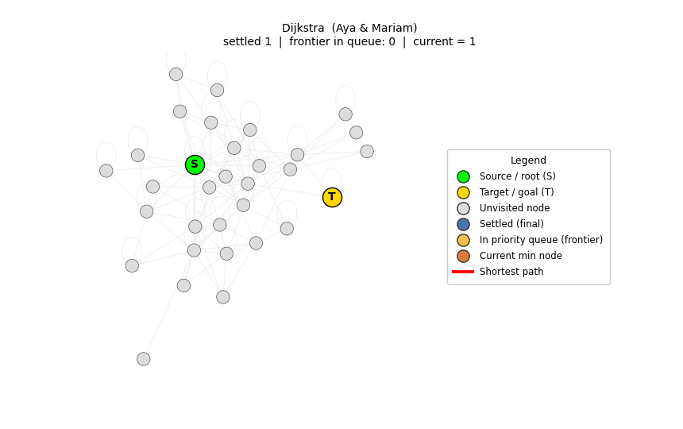 | 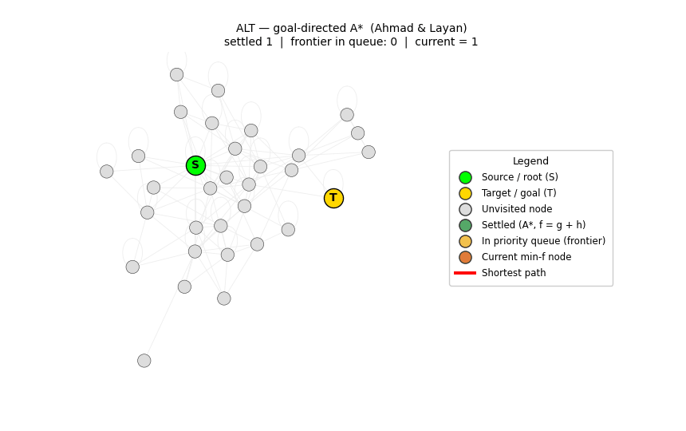 | 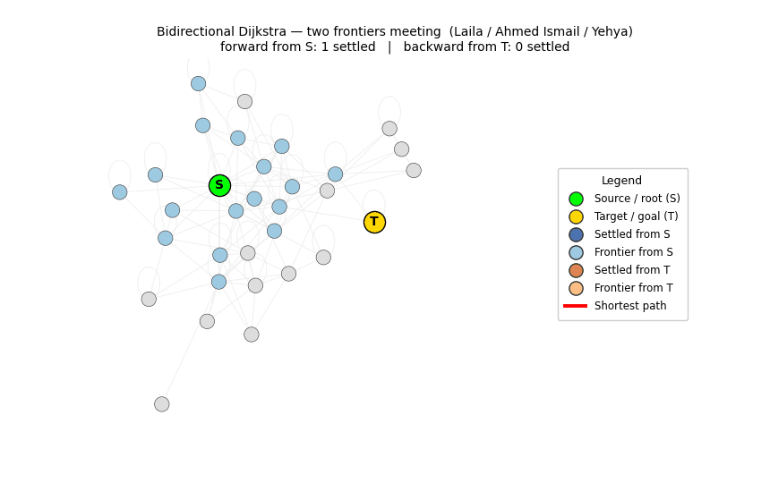 |
| expands evenly in all directions | leans toward T, settles fewer nodes | two searches meet in the middle |

| Thorup (buckets) | PLL (hub labels) | Distance oracle |
|---|---|---|
| 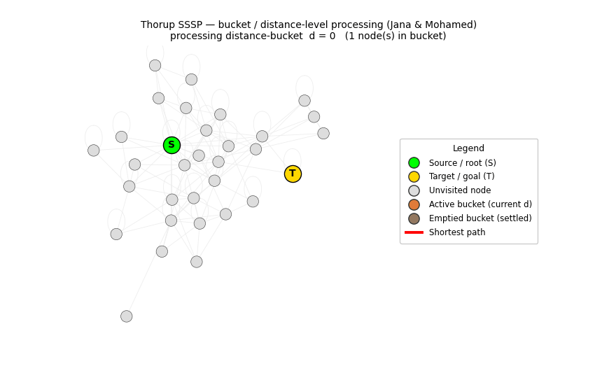 | 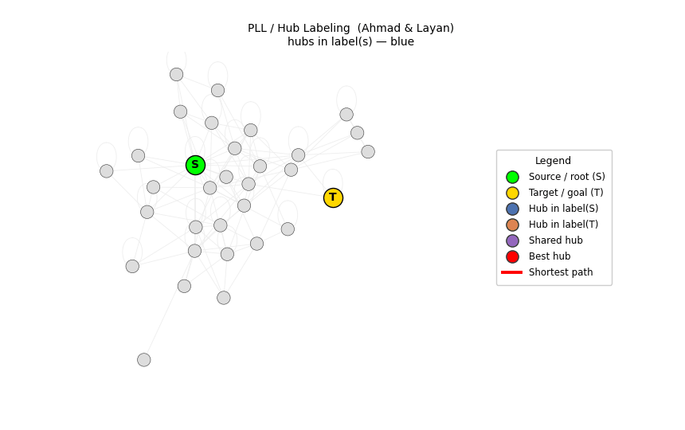 | 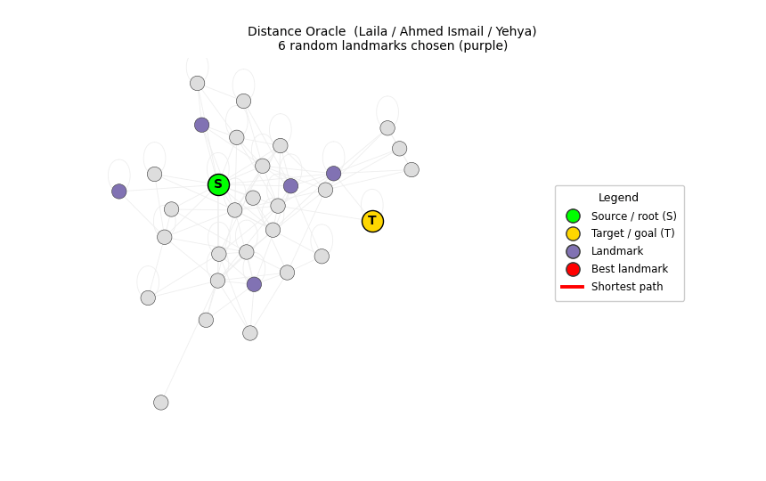 |
| empties one distance level at a time | meets through a shared hub, no search | routes through the best landmark |

### the benchmark

We timed every algorithm on every dataset across sub-graphs of growing size. That gives 30
plots, one per algorithm-and-dataset pair:

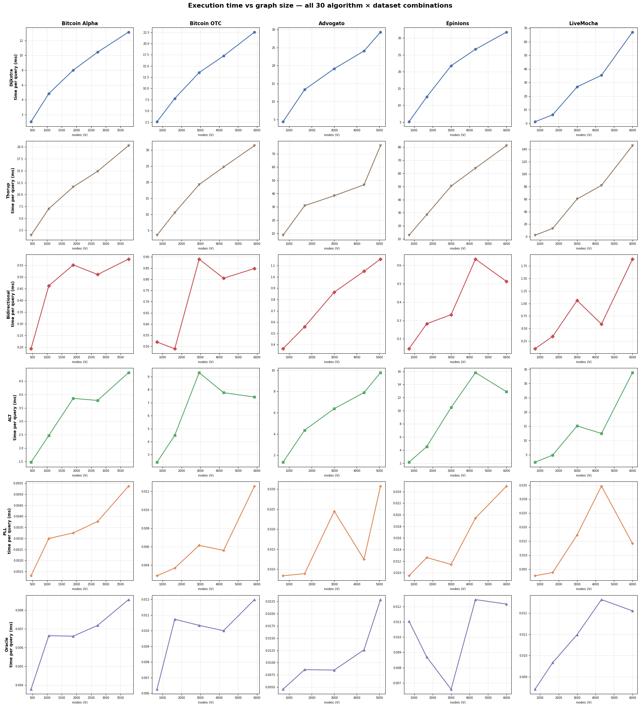

Then, one plot per dataset puts all six algorithms together so you can compare how fast each one
grows. The legend shows the fitted growth exponent `b` (around 1 is linear, near 2 is quadratic;
PLL and the oracle stay flat because their query time barely depends on size).

| | |
|---|---|
| 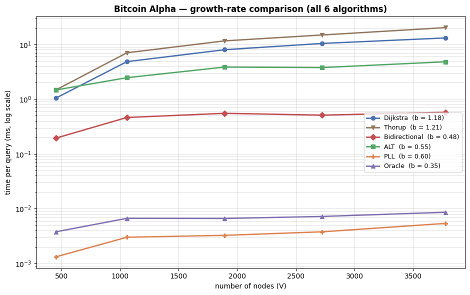 | 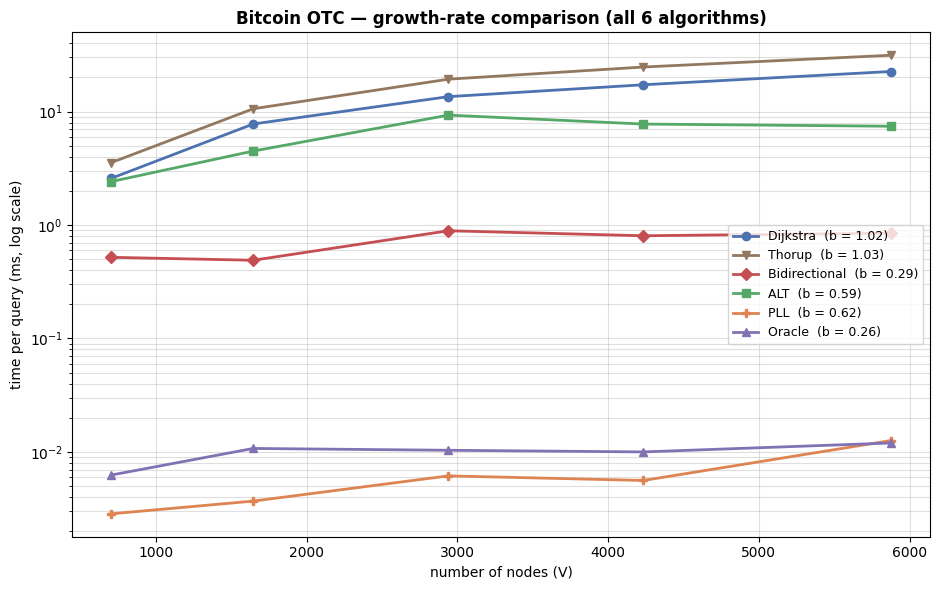 |
| 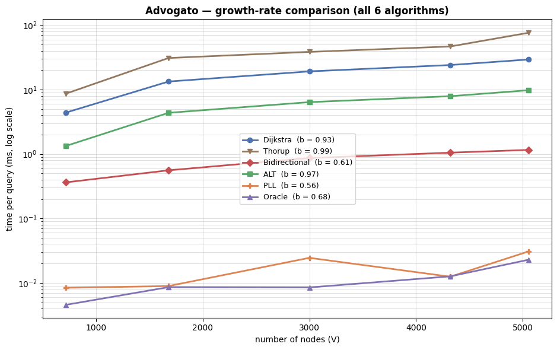 | 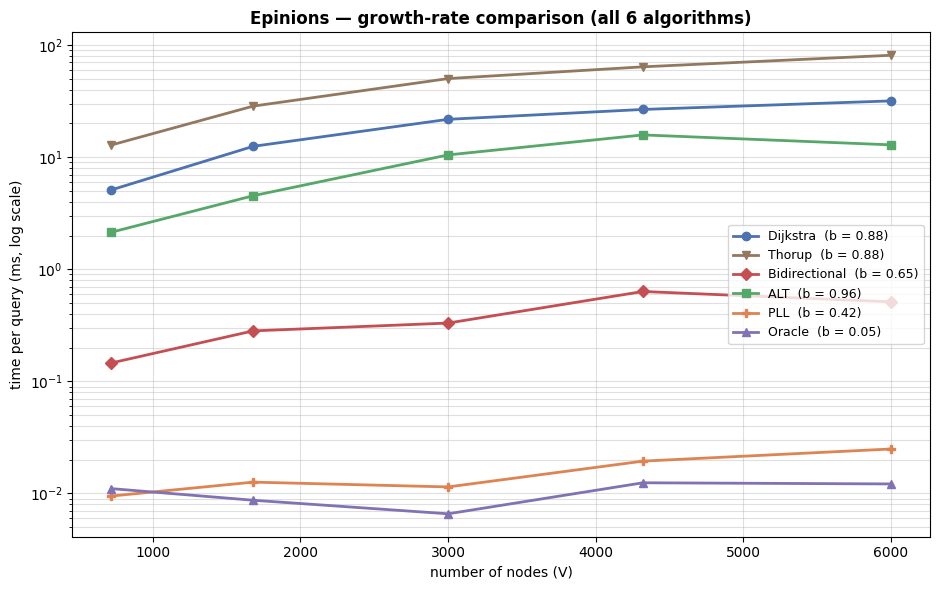 |
| 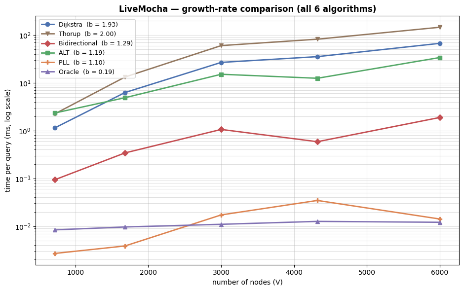 | |

## running it

Each notebook expects the dataset files to sit in the same folder. Open one in Jupyter and run
the cells top to bottom. You will need numpy, pandas, matplotlib, networkx, and scipy.
